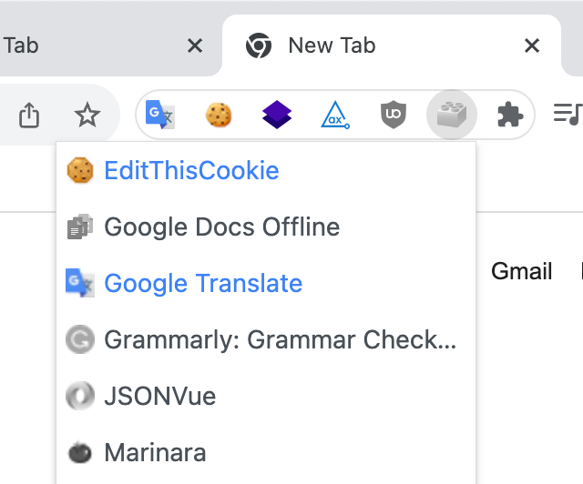

# Simple extension manager for Google Chrome

Just allows to turn on/off your extensions. Vanilla JavaScript without third-party libs.

<table>
 <tr>
    <td></td>
    <td></td>
 </tr>
</table>

## Installation

1. Clone the repository or download/unpack archive
2. In Google Chrome go to chrome://extensions/
3. Enable "Developer mode"
4. Click "Load unpacked" (just pick up repo folder)
5. Disable "Developer mode"
6. Pin extension to the Chrome toolbar
